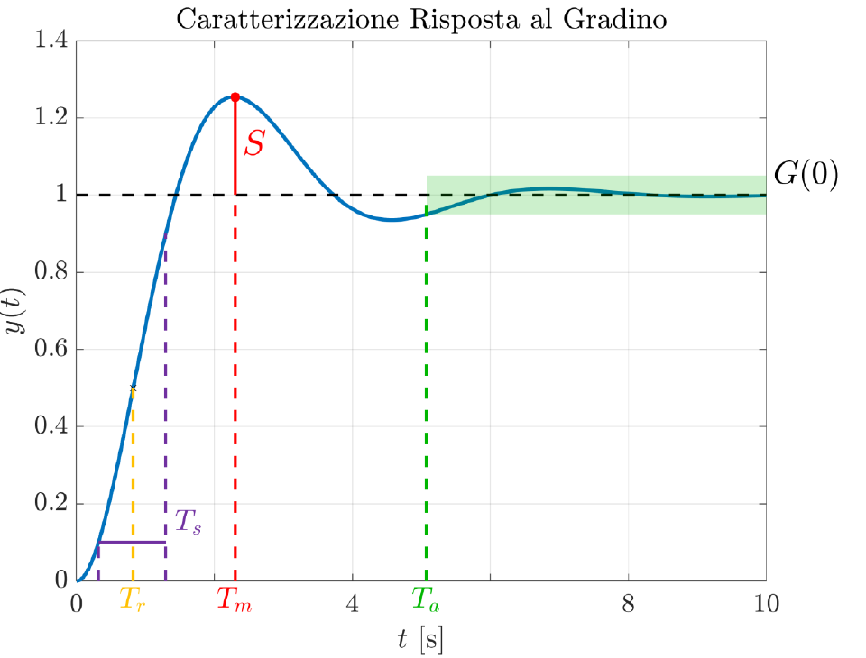

## Scomposizione della risposta: transitorio e regime permanente
La risposta temporale di un sistema dinamico asintoticamente stabile a una sollecitazione esterna può essere idealmente suddivisa in due componenti temporali distinte, il transitorio e il regime permanente. La risposta in transitorio rappresenta la parte dell'evoluzione dell'uscita che si estingue nel tempo, descrivendo il modo in cui il sistema reagisce nell'immediato alla variazione dell'ingresso. Questo contributo codifica la rapidità di reazione e l'eventuale presenza di oscillazioni prima del raggiungimento di una condizione di equilibrio. La risposta a regime è invece la parte della risposta che persiste a lungo termine, una volta esauriti gli effetti dei modi naturali transitori. Essa permette di valutare la precisione del sistema, ovvero la sua capacità di raggiungere esattamente il valore desiderato o di mantenere un errore contenuto rispetto al riferimento. L'obiettivo dell'analisi dei sistemi elementari è caratterizzare queste due fasi direttamente dalle proprietà della FdT, evitando l'onere del calcolo esplicito dell'antitrasformata di Laplace.

## Parametri caratteristici della risposta al gradino

Per confrontare le prestazioni di sistemi diversi si utilizza spesso la risposta al gradino unitario, le cui caratteristiche dinamiche sono riassunte da alcuni parametri temporali standard. Il tempo di salita $T_s$ è definito come l'intervallo necessario affinché l'uscita passi dal 10% al 90% del suo valore finale. Il tempo di ritardo $T_r$ indica il tempo occorrente per raggiungere il 50% di tale valore. La massima sovraelongazione $S$, o massimo sorpasso, rappresenta la differenza tra il valore di picco raggiunto dall'uscita e il valore di regime, solitamente espressa in percentuale rispetto a quest'ultimo. Il tempo di assestamento $T_a$ è il tempo necessario affinché l'uscita entri definitivamente in una fascia di tolleranza, tipicamente del $\pm 5\%$, centrata sul valore finale. Infine, il guadagno statico $G(0)$ identifica il valore asintotico a cui converge la risposta. Questi parametri permettono di tradurre specifiche prestazionali qualitative, come velocità e stabilità della risposta, in vincoli quantitativi sulla posizione dei poli nel piano complesso.

## Guadagno statico e teorema del valore finale
Il guadagno statico $G(0)$ è una proprietà fondamentale della FdT che descrive il rapporto tra l'uscita a regime e l'ampiezza di un ingresso costante. Per un sistema lineare tempo invariante privo di poli nell'origine, il guadagno statico è definito come il valore assunto dalla FdT per $s = 0$, ovvero $G(0) = \lim_{s \to 0} G(s)$. Il significato fisico di tale grandezza emerge chiaramente applicando il teorema del valore finale alla risposta a un gradino unitario $U(s) = 1/s$. In questo caso, il valore di regime $y_\infty = \lim_{t \to \infty} y(t)$ si calcola come $\lim_{s \to 0} s Y(s) = \lim_{s \to 0} s G(s) (1/s) = G(0)$. Ne consegue che, se il guadagno statico esiste, esso coincide esattamente con il valore finale dell'uscita per un ingresso a gradino unitario. Se l'ingresso ha ampiezza $A$, per la proprietà di linearità l'uscita a regime sarà semplicemente $A \cdot G(0)$. La conoscenza di $G(0)$ è cruciale per valutare l'accuratezza statica del sistema in assenza di disturbi.

## Sistemi elementari: gli integratori puri
I sistemi che presentano uno o più poli nell'origine della FdT sono definiti integratori puri. Un singolo polo nell'origine corrisponde a una FdT del tipo $G(s) = 1/s$, la quale implementa nel dominio del tempo l'operazione di integrazione del segnale di ingresso, $y(t) = \int_0^t u(\tau) d\tau$. Quando sollecitato da un gradino unitario, un integratore produce un'uscita che cresce linearmente nel tempo come una rampa unitaria. In presenza di poli multipli nell'origine, il sistema effettua un'integrazione ripetuta, ad esempio un doppio integratore $1/s^2$ trasforma un gradino in una parabola. La presenza di integratori ha un impatto determinante sulle prestazioni statiche, poiché un sistema che include almeno un integratore nella catena di andata di un ciclo in retroazione è in grado di annullare l'errore a regime a fronte di un riferimento costante. Tuttavia, dal punto di vista della stabilità libera, l'integratore introduce un modo naturale costante che non converge a zero, ponendo il sistema al limite della stabilità asintotica.

## Sistemi del primo ordine e costante di tempo
I sistemi elementari del primo ordine sono descritti da una FdT della forma $G(s) = \frac{1}{1+\tau s}$, dove il parametro $\tau$ è la costante di tempo che ne caratterizza interamente la dinamica. La risposta al gradino unitario di tali sistemi è data dalla funzione $y(t) = 1 - e^{-t/\tau}$, un andamento esponenziale che parte da zero con pendenza iniziale pari a $1/\tau$ e converge asintoticamente al valore unitario senza mai superarlo. La costante $\tau$ determina la velocità del sistema, per $t = \tau$ l'uscita raggiunge circa il 63,2% del valore finale, mentre per $t = 3\tau$ si arriva al 95%, valore che definisce convenzionalmente il tempo di assestamento $T_a = 3\tau$. Poiché la risposta è monotona, i sistemi del primo ordine non presentano mai sovraelongazione. Nel piano complesso, il sistema è caratterizzato da un unico polo reale situato in $s = -1/\tau$, più tale polo è distante dall'asse immaginario (ovvero $\tau$ è piccolo), più la risposta temporale risulta rapida.

## Sistemi del secondo ordine: pulsazione naturale e smorzamento
I sistemi elementari del secondo ordine con poli complessi coniugati sono caratterizzati da una FdT standard dipendente da due parametri, la pulsazione naturale $\omega_n$ e il coefficiente di smorzamento $\delta$. I poli si posizionano nel piano complesso nei punti $p_{1,2} = -\delta\omega_n \pm j\omega_n\sqrt{1-\delta^2}$. La pulsazione naturale $\omega_n$ rappresenta la distanza dei poli dall'origine e riflette la velocità intrinseca del sistema. Il coefficiente di smorzamento $\delta$, compreso tra 0 e 1 nel caso oscillatorio, governa il carattere delle oscillazioni, esso è legato all'angolo $\theta$ che i poli formano con l'asse reale tramite la relazione $\delta = \cos\theta$. La risposta al gradino presenta un andamento oscillatorio smorzato descritto da un termine sinusoidale moltiplicato per un inviluppo esponenziale $e^{-\delta\omega_n t}$. Questi sistemi sono fondamentali nella modellistica, poiché molti oggetti fisici, come il sistema massa-molla-smorzatore, manifestano questo tipo di dinamica quando soggetti a forze esterne.

## Sovraelongazione e smorzamento nei sistemi del secondo ordine
Nei sistemi del secondo ordine, la massima sovraelongazione percentuale $S$ dipende esclusivamente dal coefficiente di smorzamento $\delta$. Quando lo smorzamento è nullo ($\delta = 0$), il sistema è puramente oscillatorio e la sovraelongazione raggiunge il 100%. All'aumentare di $\delta$, le oscillazioni vengono smorzate più efficacemente e il valore di $S$ diminuisce progressivamente fino ad annullarsi quando $\delta = 1$, istante in cui i poli diventano reali e coincidenti. Matematicamente, esiste una corrispondenza biunivoca tra il valore di $S$ desiderato e il valore minimo di $\delta$ necessario per garantirlo. Questa proprietà permette di mappare le specifiche sulla sovraelongazione in una regione ammissibile del piano complesso delimitata da due semirette uscenti dall'origine. Affinché la risposta non superi un determinato sorpasso percentuale, i poli del sistema devono trovarsi all'interno del settore angolare individuato dal coefficiente di smorzamento minimo.

## Tempo di assestamento e posizione dei poli nel secondo ordine
Il tempo di assestamento $T_a$ di un sistema del secondo ordine è dettato dalla velocità con cui l'inviluppo esponenziale della risposta decade verso il valore di regime. Tale velocità è governata dal prodotto $\delta\omega_n$, che corrisponde in modulo alla parte reale $\sigma$ dei poli complessi coniugati. Utilizzando la fascia di tolleranza del 5%, il tempo di assestamento può essere approssimato dalla formula $T_a = 3 / (\delta\omega_n) = 3 / |\sigma|$. Di conseguenza, sistemi con poli che possiedono una parte reale molto negativa presentano transitori estremamente brevi. Questa relazione permette di tradurre una specifica sul tempo di assestamento massimo in un vincolo geometrico nel piano complesso, i poli devono essere posizionati a sinistra di una retta verticale di ascissa $-3/T_a$. Combinando i vincoli sulla sovraelongazione e sul tempo di assestamento, si identifica una regione di progetto nel semipiano sinistro dove i poli devono risiedere per soddisfare contemporaneamente i requisiti di precisione e velocità.

## Principio dei poli dominanti e riduzione dell'ordine
Il concetto di poli dominanti è uno strumento di semplificazione analitica che permette di approssimare la dinamica di sistemi complessi ad alto ordine mediante modelli elementari del primo o secondo ordine. Data una FdT con più poli, si definiscono dominanti quelli che si trovano nettamente più vicini all'asse immaginario rispetto agli altri. Poiché la velocità di estinzione dei modi naturali dipende dalla parte reale dei poli, i termini associati a poli molto distanti dall'asse immaginario decadono molto rapidamente, contribuendo solo alla fase iniziale del transitorio. Al contrario, i poli più vicini all'asse generano dinamiche più lente che permangono più a lungo nell'uscita e sono caratterizzate da residui analiticamente più significativi. In pratica, se esiste un distacco sufficiente tra le costanti di tempo, la risposta complessiva del sistema può essere descritta fedelmente considerando solo i poli dominanti e mantenendo inalterato il guadagno statico totale. Questo approccio riduce drasticamente la complessità della sintesi dei controllori, permettendo di basare il progetto su modelli semplificati senza perdere le caratteristiche essenziali del comportamento reale.