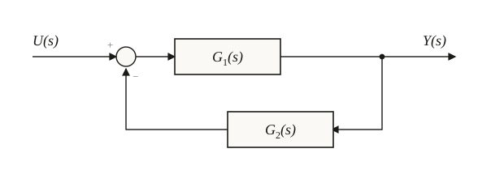

## Laplace come trasformazione funzionale
La trasformata di Laplace è una trasformazione funzionale che associa biunivocamente una funzione del tempo $f(t)$, a valori reali, con una funzione immagine $F(s)$ a valori complessi, dove $s$ è la variabile complessa di Laplace. L'utilità fondamentale di questo strumento risiede nella capacità di semplificare drasticamente la risoluzione dei modelli matematici dei sistemi dinamici. Operazioni complesse nel dominio del tempo, come la derivazione e l'integrazione, vengono infatti mappate in semplici operazioni algebriche nel dominio complesso $s$. In questo modo, un'equazione differenziale che descrive l'andamento di un sistema fisico viene trasformata in un'equazione algebrica di più facile risoluzione. Una volta ottenuta la soluzione nel dominio immagine, è possibile tornare alla descrizione temporale attraverso l'operazione di antitrasformazione di Laplace. Sebbene non tutte le funzioni siano trasformabili, le condizioni necessarie per l'esistenza della trasformata sono soddisfatte dalla stragrande maggioranza dei segnali di interesse pratico nell'ingegneria dei controlli. Il passaggio dal tempo alla variabile complessa permette quindi di analizzare la risposta dei sistemi lineari e tempo invarianti in modo sistematico, ponendo le basi per il progetto dei controllori.

## Definizione formale e teoremi del valore iniziale e finale
La trasformata di Laplace di una funzione $f(t)$ è definita dall'integrale improprio

$$F(s) = \int_0^\infty f(t)\, e^{-st}\, dt$$

mentre la trasformazione inversa permette di risalire a $f(t)$ tramite un integrale nel piano complesso. Tra le proprietà fondamentali spicca la linearità, per cui la trasformata di una combinazione lineare di segnali è pari alla combinazione lineare delle loro rispettive trasformate. Estremamente rilevante è il teorema della derivata, il quale stabilisce che

$$\mathcal{L}\!\left[\frac{d^i f(t)}{dt^i}\right] = s^i F(s) - \sum_{j=0}^{i-1} s^j f^{(i-1-j)}(0^-)$$

Nel caso di condizioni iniziali nulle, che è l'ipotesi standard per la definizione della FdT, tale espressione si semplifica notevolmente riducendosi a $s^i F(s)$. Altri due strumenti analitici di grande importanza sono il teorema del valore iniziale e il teorema del valore finale. Il primo permette di calcolare il comportamento del segnale per $t \to 0$ analizzando il limite per $s \to \infty$ della funzione immagine moltiplicata per $s$. Il secondo, di uso costante nell'analisi a regime permanente, consente di determinare il valore asintotico dell'uscita per $t \to \infty$ calcolando il limite per $s \to 0$ di $s F(s)$. Una proprietà ulteriore, la traslazione nel tempo, stabilisce che ritardare un segnale di un tempo $t_0$ equivale a moltiplicarne la trasformata per un esponenziale complesso:

$$\mathcal{L}[f(t-t_0)] = F(s)\, e^{-s t_0}$$

È questa la relazione che permette di rappresentare un ritardo puro nel dominio di Laplace come il fattore $e^{-s\tau}$. Queste proprietà rendono la trasformata di Laplace non solo un metodo di calcolo, ma un vero e proprio ponte tra le specifiche temporali e la rappresentazione analitica nel dominio della frequenza complessa.

## Trasformate di Laplace dei segnali canonici
L'analisi dei sistemi dinamici si avvale della trasformata di Laplace di alcuni segnali fondamentali, detti segnali canonici, che rappresentano sollecitazioni tipiche.

| Segnale | $f(t)$ | $F(s)$ |
| --- | --- | --- |
| impulso unitario | $\delta(t)$ | $1$ |
| gradino unitario | $u(t)$ | $1/s$ |
| rampa unitaria | $t$ | $1/s^2$ |
| parabola unitaria | $t^2/2$ | $1/s^3$ |
| esponenziale | $e^{at}$ | $1/(s-a)$ |
| seno | $\sin(\omega t)$ | $\omega/(s^2+\omega^2)$ |
| coseno | $\cos(\omega t)$ | $s/(s^2+\omega^2)$ |

Il gradino unitario è il segnale di riferimento per lo studio della risposta a regime e della stabilità, mentre seno e coseno sono i pilastri dell'analisi armonica. Una relazione di carattere generale permette di ricavare la quasi totalità delle trasformate di interesse corrente:

$$\mathcal{L}\!\left[t^n e^{at}\right] = \frac{n!}{(s-a)^{n+1}}$$

dove $n$ è un intero positivo e $a$ una costante reale o complessa. Questa formula è particolarmente potente perché consente di gestire termini che includono contemporaneamente andamenti polinomiali, esponenziali e, tramite le formule di Eulero, componenti oscillatorie. La conoscenza di queste coppie permette di procedere per ispezione e consultazione di tabelle standard, semplificando il processo di analisi dei sistemi lineari.

## Numeri complessi e radici del polinomio caratteristico
Poiché la FdT è un rapporto tra polinomi nella variabile complessa $s$, l'analisi dei sistemi di controllo si appoggia costantemente su un risultato fondamentale dell'algebra, il teorema fondamentale dell'algebra, secondo cui un'equazione polinomiale di grado $n$ ammette esattamente $n$ soluzioni nel campo dei numeri complessi, contate con la propria molteplicità. I numeri reali sono un sottoinsieme dei numeri complessi, per cui questo risultato vale anche quando alcune (o tutte) le radici risultano reali. Una seconda proprietà, valida per i polinomi a coefficienti reali come quelli che compaiono nelle FdT dei sistemi fisici, è che se un'equazione ammette una soluzione complessa, ammette necessariamente anche la sua complessa coniugata: le radici complesse compaiono quindi sempre in coppie. Ad esempio, l'equazione $s^2+1=0$ ha le due soluzioni coniugate $s=\pm j$, mentre $s^3+s=0$, fattorizzabile come $s(s^2+1)=0$, ha una radice reale nulla e la coppia coniugata $s=\pm j$. Applicato al polinomio caratteristico di una FdT, cioè al suo denominatore, questo risultato garantisce che un sistema di ordine $n$ possieda esattamente $n$ poli nel piano complesso, reali o organizzati in coppie complesse coniugate: è la base che rende possibile la scomposizione in fratti semplici e la classificazione dei sistemi elementari del primo e del secondo ordine.

## Definizione e significato della FdT
La Funzione di Trasferimento (FdT) rappresenta il modello matematico di un sistema lineare tempo invariante (LTI) nel dominio della variabile complessa $s$. Essa è definita come il rapporto tra la trasformata di Laplace dell'uscita $Y(s)$ e la trasformata di Laplace dell'ingresso $U(s)$, calcolato sotto l'ipotesi di condizioni iniziali nulle. Matematicamente si esprime come

$$G(s) = \frac{Y(s)}{U(s)}$$

Il grande vantaggio della FdT risiede nella sua natura algebrica, poiché a differenza dei modelli nel dominio del tempo che richiedono equazioni differenziali, la relazione tra ingresso e uscita diventa una semplice moltiplicazione:

$$Y(s) = G(s)\, U(s)$$

In questo contesto, la FdT descrive completamente il comportamento dinamico forzato del sistema, ovvero come esso reagisce a una sollecitazione esterna partendo da uno stato di quiete. Per i sistemi a parametri concentrati, la FdT assume la forma di una funzione razionale fratta, ovvero un rapporto tra due polinomi in $s$. Il polinomio al denominatore è detto polinomio caratteristico e le sue radici determinano le proprietà di stabilità e i modi naturali del sistema. La FdT costituisce quindi uno strumento sintetico ed efficace per rappresentare la dinamica di un oggetto fisico, permettendo di analizzarne le prestazioni senza dover risolvere direttamente i sistemi di equazioni differenziali originali.

## Derivazione della FdT dal modello IU
Dato un sistema descritto da un'equazione differenziale lineare a coefficienti costanti nella forma della rappresentazione esterna IU, è possibile ricavare la FdT applicando sistematicamente la trasformata di Laplace a entrambi i membri dell'equazione. Si consideri un'equazione del tipo

$$a_n \frac{d^n y(t)}{dt^n} + \dots + a_0\, y(t) = b_m \frac{d^m u(t)}{dt^m} + \dots + b_0\, u(t)$$

Sfruttando la proprietà di linearità e il teorema della derivata con condizioni iniziali nulle, ogni derivata di ordine $i$ viene sostituita dal termine $s^i$ che moltiplica la funzione trasformata. L'equazione differenziale si trasforma quindi in un'uguaglianza algebrica tra polinomi in $s$, dove $Y(s)$ e $U(s)$ possono essere raccolti a fattor comune. La FdT si ottiene come il rapporto tra il polinomio associato alla parte dell'ingresso e quello associato alla parte dell'uscita:

$$G(s) = \frac{\sum_{i=0}^m b_i s^i}{\sum_{i=0}^n a_i s^i}$$

Questo rapporto di polinomi racchiude tutta l'informazione sulla struttura del sistema, i coefficienti $a_i$ e $b_i$ derivano direttamente dai parametri fisici del sistema originale, come masse, elasticità o parametri elettrici. Il passaggio al modello algebrico è il primo passo fondamentale per lo studio della stabilità e della risposta del sistema.

## Derivazione della FdT dalla rappresentazione ISU
Sebbene la FdT sia definita primariamente per la rappresentazione esterna IU, essa può essere derivata anche partendo dal modello di stato interno ISU, costituito dall'equazione di stato e dall'equazione di uscita:

$$\dot{x}(t) = A\,x(t) + B\,u(t), \qquad y(t) = C\,x(t) + D\,u(t)$$

Applicando la trasformata di Laplace a entrambe le equazioni e ipotizzando lo stato iniziale nullo $x(0) = 0$, si ottiene un sistema di equazioni algebriche nel dominio complesso $s$. Dall'equazione di stato trasformata, $sX(s) = AX(s) + BU(s)$, è possibile isolare il vettore di stato, dove $I$ rappresenta la matrice identità di dimensioni opportune:

$$X(s) = (sI - A)^{-1} B\, U(s)$$

Sostituendo questa espressione nell'equazione di uscita trasformata si ricava il legame diretto tra l'ingresso e l'uscita, e con esso la funzione di trasferimento:

$$Y(s) = \left[C(sI - A)^{-1}B + D\right] U(s), \qquad G(s) = C(sI - A)^{-1}B + D$$

Questa formulazione dimostra che la FdT è una proprietà intrinseca del sistema che può essere vista come la proiezione del comportamento interno variabile nello spazio di stato sulla relazione osservabile tra le sollecitazioni esterne e le risposte misurabili. La capacità di passare dalla rappresentazione interna a quella esterna garantisce flessibilità nell'uso degli strumenti matematici per lo studio della dinamica.

## Interconnessione di sistemi e schemi a blocchi

La FdT è lo strumento ideale per rappresentare sistemi complessi attraverso gli schemi a blocchi, dove ogni componente è raffigurato come un blocco funzionale che trasforma un segnale di ingresso in uno di uscita. L'interconnessione tra sistemi segue regole algebriche precise nel dominio di Laplace. Quando due sistemi con FdT $G_1(s)$ e $G_2(s)$ sono connessi in serie (o in cascata), ovvero l'uscita del primo è l'ingresso del secondo, la FdT complessiva è data dal prodotto delle singole funzioni:

$$G_{eq}(s) = G_1(s)\, G_2(s)$$

Se i sistemi sono disposti in parallelo, ovvero condividono lo stesso ingresso e le loro uscite vengono sommate, la FdT risultante è la somma delle singole funzioni:

$$G_{eq}(s) = G_1(s) + G_2(s)$$

Una delle configurazioni più importanti è la retroazione, in cui un blocco $G_1(s)$ riceve in ingresso la differenza tra il riferimento $U(s)$ e il segnale $G_2(s)Y(s)$ riportato indietro dal ramo di retroazione. Risolvendo rispetto a $Y(s)$ l'equazione

$$Y(s) = G_1(s)\left[U(s) - G_2(s)\, Y(s)\right]$$

si ottiene la FdT equivalente, che compare costantemente nell'analisi dei sistemi in retroazione:

$$G_{eq}(s) = \frac{G_1(s)}{1 + G_1(s)\, G_2(s)}$$

Ridurre uno schema a blocchi significa risalire dall'uscita verso l'ingresso applicando queste tre regole algebriche per ottenere un'unica FdT globale. Questa scomposizione modulare permette di gestire la complessità di impianti articolati analizzando separatamente i singoli sottosistemi per poi ricomporre il modello totale, facilitando sia la fase di modellistica che quella di sintesi del controllore.