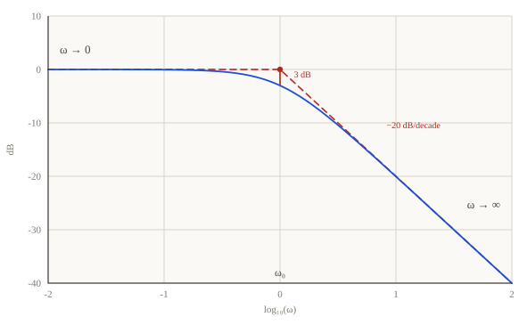

## Analisi armonica e scomposizione dei segnali
L'analisi armonica rappresenta lo studio del comportamento di un sistema dinamico nel dominio delle frequenze, distinguendosi dall'analisi nel dominio del tempo basata sulla risposta a sollecitazioni quali il gradino o la rampa. Questo approccio è fondamentale perché la maggior parte dei segnali reali non ha andamenti semplici, ma contiene componenti a diverse frequenze, alcune delle quali portano l'informazione utile, mentre altre rappresentano rumore o disturbi indesiderati. Lo strumento matematico alla base di questa analisi è lo sviluppo in serie di Fourier, il quale stabilisce che ogni segnale periodico può essere espresso come combinazione lineare di infiniti termini sinusoidali, detti armoniche, caratterizzati da una specifica ampiezza e sfasamento. Per i segnali non periodici, tale concetto viene esteso tramite la trasformata di Fourier, che scompone il segnale in uno spettro continuo di frequenze. Nell'ambito dei sistemi lineari e tempo invarianti, esiste un legame diretto tra la trasformata di Laplace e quella di Fourier, per i segnali nulli per tempi negativi, la trasformata di Fourier si ottiene semplicemente valutando la trasformata di Laplace sulla sola parte immaginaria della variabile complessa, ovvero ponendo $s = j\omega$. Questa equivalenza permette di passare agevolmente dalla descrizione analitica della FdT alla caratterizzazione armonica del sistema.

## La funzione di risposta armonica e il legame con la FdT
La funzione di risposta armonica è l'analogo della funzione di trasferimento per l'analisi nel dominio delle frequenze. Essa descrive come un sistema lineare stazionario e asintoticamente stabile risponde a un ingresso sinusoidale del tipo $u(t) = X \sin(\omega t)$. Una proprietà fondamentale di tali sistemi è che, una volta esaurito il transitorio, l'uscita a regime è ancora una sinusoide avente la medesima pulsazione $\omega$ dell'ingresso, ma con ampiezza e fase modificate. Matematicamente, la funzione di risposta armonica $G(j\omega)$ è una funzione complessa della pulsazione reale $\omega$, definita dal rapporto tra la rappresentazione complessa dell'uscita e dell'ingresso. Il suo modulo $|G(j\omega)|$ indica il fattore di amplificazione o attenuazione del segnale a quella specifica frequenza, mentre il suo argomento $\arg(G(j\omega))$ rappresenta lo sfasamento introdotto dal sistema. Come dimostrato analiticamente, questa funzione coincide esattamente con la FdT valutata ponendo $s = j\omega$. Grazie al principio di sovrapposizione degli effetti, conoscendo la risposta armonica è possibile determinare l'uscita del sistema per qualunque ingresso complesso, semplicemente decomponendo l'ingresso nelle sue componenti armoniche e valutando come ciascuna di esse venga singolarmente filtrata dal sistema.

## Il sistema dinamico come filtro e lo spettro del segnale
L'analisi armonica permette di interpretare un sistema dinamico come un filtro che agisce sul contenuto frequenziale dei segnali di ingresso. Ogni sistema possiede una propria banda passante, ovvero un intervallo di frequenze in cui il modulo della risposta armonica è significativo, permettendo alle relative componenti del segnale di attraversare il sistema senza subire forti attenuazioni. Al di fuori di tale banda, le componenti armoniche vengono "tagliate", ovvero ridotte drasticamente in ampiezza. Questa prospettiva è di estrema utilità pratica nella progettazione dei sistemi di controllo, poiché consente di configurare il sistema in modo che lasci passare le informazioni utili, tipicamente concentrate alle basse frequenze, e attenui i disturbi o il rumore di misura che si manifestano solitamente alle alte frequenze. Lo spettro di un segnale, dato dal modulo e dalla fase della sua trasformata di Fourier, fornisce la distribuzione dell'energia del segnale alle diverse frequenze. Confrontando lo spettro del segnale con la risposta armonica del sistema, il progettista può prevedere con precisione quali parti del segnale originale verranno preservate e quali verranno rimosse o sfasate, valutando così le capacità filtranti intrinseche della struttura dinamica considerata.

## Diagrammi di Bode: scale logaritmiche e decibel
La rappresentazione grafica della funzione di risposta armonica viene comunemente effettuata tramite i diagrammi di Bode, che consistono in due grafici distinti: il diagramma delle ampiezze (o dei moduli) e il diagramma delle fasi. Una caratteristica essenziale di questi diagrammi è l'utilizzo della scala logaritmica per l'asse delle pulsazioni $\omega$. Questo permette di rappresentare con lo stesso dettaglio grandezze che variano in campi molto estesi, condensando diverse decadi di frequenza in uno spazio leggibile. Nel diagramma delle ampiezze, il modulo della funzione di risposta armonica viene espresso in Decibel (dB), un'unità logaritmica definita come

$$|G(j\omega)|_{\text{dB}} = 20 \log_{10} |G(j\omega)|$$

L'uso dei decibel e dei logaritmi trasforma le operazioni di moltiplicazione e divisione tra i termini della FdT in semplici somme e sottrazioni grafiche. Il diagramma delle fasi riporta invece l'argomento della funzione complessa, solitamente in gradi o radianti, in funzione del logaritmo della pulsazione. Grazie a queste convenzioni, i diagrammi di Bode permettono di costruire la risposta armonica di sistemi complessi componendo graficamente i contributi di termini elementari, rendendo l'analisi della dinamica estremamente intuitiva e immediata rispetto all'uso di scale lineari.

## Tracciamento per termini elementari
Per tracciare agevolmente i diagrammi di Bode, la FdT del sistema deve essere preventivamente scritta nella forma delle costanti di tempo (forma di Bode). In questa configurazione, la risposta armonica complessiva appare come il prodotto di quattro tipologie di termini elementari: il guadagno statico, i poli o zeri nell'origine, i termini del primo ordine e i termini del secondo ordine. Il guadagno $\mu$ contribuisce con un modulo costante pari a $20 \log_{10} |\mu|$ dB e una fase costante di 0 gradi se positivo, o -180 gradi se negativo. Un polo nell'origine implementa un'azione integratrice, graficamente rappresentata da una retta con pendenza costante di -20 dB per decade che attraversa lo zero a $\omega = 1$, con una fase fissa di -90 gradi. Al contrario, uno zero nell'origine ha pendenza positiva di +20 dB per decade e fase di +90 gradi. La presenza di più poli o zeri nell'origine moltiplica semplicemente questi valori per l'ordine di molteplicità $g$. Grazie alle proprietà logaritmiche, il diagramma di Bode finale del sistema si ottiene sommando punto per punto i contributi di ciascun termine elementare, permettendo una costruzione manuale rapida tramite l'approssimazione asintotica a spezzate.

## Termini del primo ordine e asintoti

I termini del primo ordine, espressi nella forma $(1 + j\omega \tau)^{\pm 1}$, sono caratterizzati da un parametro fondamentale detto punto di rottura, situato alla pulsazione $\omega_0 = 1/|\tau|$. Per un polo del primo ordine, il diagramma delle ampiezze reale viene approssimato asintoticamente da una spezzata composta da due semirette: una retta orizzontale a 0 dB per pulsazioni molto minori del punto di rottura e una retta con pendenza di -20 dB per decade per pulsazioni superiori. Il massimo errore di questa approssimazione si verifica proprio nel punto di rottura e vale circa 3 dB. Il diagramma delle fasi del polo del primo ordine passa da 0 gradi (basse frequenze) a -90 gradi (alte frequenze), assumendo il valore di -45 gradi esattamente in $\omega_0$. Graficamente, la fase viene approssimata con una spezzata che inizia la sua discesa una decade prima del punto di rottura e termina una decade dopo. Nel caso di uno zero del primo ordine, i diagrammi risultano perfettamente ribaltati rispetto all'asse orizzontale, con pendenza positiva di +20 dB per decade e fase che sale verso +90 gradi. Se la costante di tempo $\tau$ è negativa, il diagramma delle ampiezze rimane invariato, mentre quello delle fasi risulta ribaltato, riflettendo la natura instabile del termine.

## Termini del secondo ordine e risonanza

I termini del secondo ordine presentano una fenomenologia più complessa legata alla presenza di poli complessi coniugati, definiti dalla pulsazione naturale $\omega_n$ e dal coefficiente di smorzamento $\delta$. L'approssimazione asintotica del modulo per un termine del secondo ordine segue una spezzata che rimane a 0 dB fino a $\omega_n$ e poi scende con una pendenza di -40 dB per decade. Tuttavia, a differenza del primo ordine, il diagramma reale può discostarsi significativamente dagli asintoti in prossimità della pulsazione naturale. Se lo smorzamento $\delta$ è piccolo (inferiore a circa 0,707), il diagramma presenta un picco di risonanza $M_R$, ovvero un valore massimo dell'ampiezza che può essere molto elevato per valori di $\delta$ prossimi allo zero. La pulsazione a cui si verifica questo massimo è detta pulsazione di risonanza $\omega_R$. Anche il diagramma delle fasi mostra una transizione da 0 a -180 gradi, passando per -90 gradi in corrispondenza di $\omega_n$. La velocità di questa transizione dipende strettamente dallo smorzamento: per $\delta$ molto piccoli la fase varia quasi istantaneamente, mentre per $\delta$ grandi la variazione è più graduale. La comprensione di questi fenomeni è cruciale poiché la risonanza può indurre forti oscillazioni nel sistema se sollecitato a frequenze vicine a quelle naturali, come nei celebri casi storici di cedimenti strutturali dovuti a sollecitazioni armoniche.