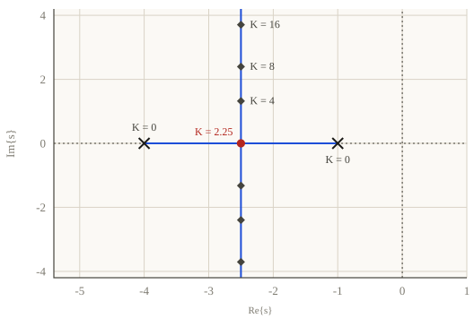

## Motivazione e necessità del Luogo delle Radici
Il progetto di un sistema di controllo richiede il soddisfacimento di specifiche sia statiche che dinamiche. Mentre le specifiche statiche, come il contenimento dell'errore a regime, possono essere spesso garantite agendo semplicemente sul guadagno statico del controllore, un incremento eccessivo di tale parametro può avere effetti deleteri sulla stabilità e sul comportamento transitorio. Come osservato in alcuni sistemi reali, un guadagno elevato atto a ridurre l'errore di posizione può spingere i poli del sistema a ciclo chiuso verso il semipiano destro, rendendo l'uscita instabile o eccessivamente oscillante. L'analisi analitica della posizione dei poli al variare del guadagno $K$ risulta complessa anche per sistemi di ordine ridotto, poiché richiede lo studio delle radici di un'equazione caratteristica le cui soluzioni variano in modo non lineare rispetto al parametro. Il Luogo delle Radici nasce dunque come uno strumento grafico intuitivo per visualizzare come il movimento dei poli a ciclo chiuso nel piano complesso sia influenzato dal guadagno del controllore. Esso permette di identificare i valori di $K$ che garantiscono la stabilità asintotica e le prestazioni dinamiche desiderate, quali la massima sovraelongazione e il tempo di assestamento.

## Definizione e proprietà strutturali del Luogo delle Radici

Il Luogo delle Radici è un diagramma che rappresenta il percorso tracciato sul piano complesso $s$ dalle radici dell'equazione caratteristica del sistema a ciclo chiuso

$$1 + K\,G(s) = 0$$

al variare del guadagno $K$ del controllore in un intervallo che va da 0 a $\infty$. Solitamente si considerano solo valori positivi di $K$, poiché i guadagni negativi tendono ad avere un effetto destabilizzante sulla maggior parte degli impianti. Tale diagramma possiede proprietà geometriche rigorose derivanti dalla struttura della FdT a ciclo aperto. Il numero di rami che compongono il luogo è esattamente pari al numero $n$ di poli della FdT a ciclo aperto. Ogni ramo ha origine, per $K=0$, in corrispondenza di un polo del sistema a ciclo aperto e termina, per $K \to \infty$, o in uno zero del medesimo sistema oppure all'infinito seguendo direzioni asintotiche prestabilite. Una proprietà fondamentale per il tracciamento manuale è la simmetria del diagramma rispetto all'asse reale, dovuta alla natura dei poli del sistema che, se complessi, devono necessariamente presentarsi in coppie coniugate per garantire coefficienti reali nel polinomio caratteristico.

## Tracciamento sull'asse reale e comportamento asintotico
Per disegnare correttamente il Luogo delle Radici, è essenziale identificare quali porzioni dell'asse reale appartengano al diagramma. Un punto dell'asse reale fa parte del luogo se e solo se lascia alla sua destra un numero totale dispari di singolarità, ovvero la somma di poli e zeri reali a ciclo aperto. Per i rami che non terminano su uno zero finito e tendono quindi all'infinito, il comportamento per grandi valori di $K$ è descritto da una stella di asintoti. Il numero di tali asintoti è pari al grado relativo del sistema, definito dalla differenza $n - m$ tra il numero di poli e il numero di zeri. Questi asintoti si incontrano in un unico punto dell'asse reale chiamato centro stella $\sigma_a$, la cui posizione è data dalla differenza tra la somma delle ascisse dei poli e quella degli zeri, pesata sul grado relativo:

$$\sigma_a = \frac{\sum_{i=1}^n p_i - \sum_{i=1}^m z_i}{n-m}$$

Gli angoli formati dagli asintoti rispetto all'asse reale sono equispaziati e dipendono anch'essi dal grado relativo:

$$\theta_{a,\nu} = \frac{(2\nu+1)\pi}{n-m}, \qquad \nu = 0, 1, \dots, n-m-1$$

Per un grado relativo pari a 1 si ha un solo asintoto a $180°$, per un grado relativo pari a 2 due asintoti a $\pm 90°$, e così via. La conoscenza della stella degli asintoti permette di prevedere immediatamente se, per guadagni molto elevati, i poli varcheranno l'asse immaginario portando il sistema all'instabilità.

## Il Luogo delle Radici come strumento di progetto
Il Luogo delle Radici costituisce un potente strumento di sintesi, poiché permette di mappare le specifiche dinamiche richieste direttamente sul piano complesso. Requisiti come la massima sovraelongazione percentuale $S_p$ e il tempo di assestamento $T_a$ definiscono delle regioni di ammissibilità all'interno del piano $s$. Ad esempio, una specifica sulla sovraelongazione individua un settore angolare centrato nell'origine, mentre un vincolo sul tempo di assestamento massimo definisce un semipiano a sinistra di una retta verticale di opportuna ascissa. Il progettista utilizza il diagramma per verificare se esiste un valore del guadagno $K$ tale per cui i poli del sistema a ciclo chiuso ricadano stabilmente all'interno di quest'area desiderata. In caso positivo, il valore di $K$ viene determinato garantendo che il sistema si comporti in modo approssimabile a un modello elementare del primo o secondo ordine con le caratteristiche transitorie richieste. Se nessun valore di $K$ soddisfa i vincoli, il Luogo delle Radici indica chiaramente come la struttura del controllore debba essere modificata per deformare il percorso dei poli verso la regione ammissibile.

## Sintesi tramite aggiunta di poli e zeri
Qualora non sia possibile soddisfare le specifiche di progetto semplicemente variando il guadagno proporzionale $K$, si procede modificando la funzione di trasferimento del controllore $C(s)$ tramite l'aggiunta di poli e zeri. L'inserimento di un polo nell'origine è spesso dettato dalla necessità di soddisfare specifiche statiche, come l'annullamento dell'errore a regime per ingressi a gradino, incrementando il tipo del sistema. Tuttavia, l'aggiunta di poli ha l'effetto di flettere i rami del luogo verso destra, peggiorando potenzialmente la stabilità e la velocità della risposta. Al contrario, l'inserimento di zeri nel controllore esercita un'azione attrattiva sui rami, portandoli verso il semipiano sinistro. Questo permette di stabilizzare sistemi intrinsecamente critici e di velocizzare la dinamica transitoria. Il processo di sintesi diventa quindi una ricerca della configurazione di singolarità che deformi opportunamente il luogo delle radici, assicurando che per un certo intervallo di $K$ i poli dominanti del sistema a ciclo chiuso rispettino tutti i vincoli di progetto.

## La tecnica della cancellazione poli-zeri e i relativi rischi
Una strategia efficace nel progetto del controllore consiste nell'utilizzare gli zeri o i poli del regolatore per cancellare le singolarità indesiderate della FdT del plant $G(s)$. Ad esempio, se l'impianto presenta un polo reale molto vicino all'origine che rallenta eccessivamente la risposta, il controllore può essere progettato con uno zero nella medesima posizione per annullarne l'effetto nel guadagno d'anello $L(s)$. Successivamente, si introduce un nuovo polo in una posizione più favorevole per imporre la dinamica desiderata. Tuttavia, questa pratica richiede estrema cautela operativa. Poiché i modelli matematici sono sempre approssimazioni e i parametri fisici possono subire variazioni, la cancellazione non risulta mai perfetta nella realtà. Se si tenta di cancellare un polo instabile, situato nel semipiano destro, anche una minima imprecisione lascerebbe un residuo di polo instabile a ciclo chiuso, causando la divergenza dell'uscita. Per tale motivo, è una regola fondamentale dell'automazione non tentare mai la cancellazione di poli o zeri instabili, limitando tale tecnica esclusivamente a dinamiche stabili e ben modellate.
