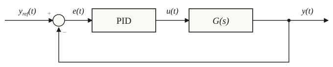

## Definizione e struttura del regolatore PID

Il regolatore Proporzionale-Integrale-Derivativo, noto come PID, costituisce lo standard de facto nell'automazione industriale grazie alla sua efficacia e alla relativa semplicità di taratura anche in assenza di un modello matematico preciso dell'impianto. Questo controllore genera un'azione di comando $u(t)$ combinando tre contributi distinti applicati all'errore di controllo $e(t)$, definito come la differenza tra il riferimento desiderato e l'uscita misurata. Nel dominio del tempo, la legge di controllo è espressa dalla relazione:

$$u(t) = K_p \left( e(t) + \frac{1}{T_i} \int_0^t e(\tau) d\tau + T_d \dot{e}(t) \right)$$

dove $K_p$ rappresenta il guadagno proporzionale, mentre $T_i$ e $T_d$ sono rispettivamente le costanti di tempo dell'azione integrale e derivativa. Applicando la trasformata di Laplace con condizioni iniziali nulle, si ottiene la Funzione di Trasferimento (FdT) del regolatore in forma ideale:

$$G_{PID}(s) = K_p \left( 1 + \frac{1}{sT_i} + sT_d \right)$$

Tale struttura algebrica evidenzia la presenza di un polo nell'origine, introdotto dall'azione integrale, e di due zeri, la cui posizione dipende dalla scelta dei parametri temporali. Il successo del PID risiede nella sua versatilità, esso può essere configurato come regolatore P, PI o PD disattivando le azioni non necessarie, permettendo di adattarsi a un'ampia gamma di processi fisici con un ottimo rapporto tra costo di progetto e prestazioni ottenute.

## Il ruolo delle azioni proporzionale, integrale e derivativa
Ciascuna delle tre componenti del regolatore PID assolve a un compito specifico nel determinare l'andamento della risposta del sistema. L'azione proporzionale genera un comando direttamente proporzionale all'ampiezza dell'errore istantaneo, maggiore è lo scostamento dal riferimento, più energica sarà la correzione impressa. Tuttavia, la sola azione P non è solitamente sufficiente ad annullare l'errore a regime per ingressi costanti. Questo limite viene superato dall'azione integrale, la quale accumula l'errore nel tempo. Dal punto di vista della FdT, essa introduce un polo nell'origine che incrementa il tipo del sistema, garantendo teoricamente un errore nullo in regime permanente a fronte di riferimenti o disturbi a gradino. L'azione derivativa, infine, agisce sulla pendenza dell'errore, fornendo un contributo "preventivo" che anticipa l'evoluzione futura del segnale. Questo termine introduce un anticipo di fase che migliora lo smorzamento e la stabilità del transitorio, permettendo di ridurre le oscillazioni e la sovraelongazione. Il progettista deve bilanciare accuratamente questi tre contributi: un'eccessiva azione integrale può destabilizzare il ciclo portando a oscillazioni lente, mentre una derivata troppo spinta può rendere il sistema eccessivamente sensibile al rumore di misura.

## Realizzabilità fisica e filtraggio dell'azione derivativa
L'espressione ideale della FdT del PID presenta un limite teorico significativo: il termine derivativo puro $sT_d$ possiede un grado del numeratore superiore a quello del denominatore, rendendo il sistema improprio e non fisicamente realizzabile. Inoltre, un derivatore ideale amplificherebbe indefinitamente i disturbi ad alta frequenza, come il rumore introdotto dai sensori, compromettendo la stabilità dell'azione di controllo. Per risolvere queste criticità, nella pratica industriale l'azione derivativa viene sempre approssimata introducendo un polo reale ad alta frequenza, trasformandola in una funzione di trasferimento propria:

$$T_d s \approx \frac{T_d s}{1 + \frac{T_d}{N} s}$$

Il parametro $N$, solitamente scelto in un intervallo compreso tra 5 e 20, determina la posizione della pulsazione di rottura $\omega_0 = N/T_d$. Scegliendo $N$ sufficientemente grande, il comportamento del regolatore rimane identico a quello ideale all'interno della banda passante di interesse per il controllo, garantendo l'anticipo di fase desiderato. Al di sopra di $\omega_0$, invece, il guadagno del termine derivativo smette di crescere e si stabilizza a un valore costante pari a $K_p N$, limitando efficacemente l'amplificazione del rumore di misura. Questa modifica garantisce che il PID sia implementabile sia tramite circuiti analogici che tramite algoritmi software nei controllori digitali.

## Analisi del regolatore Proporzionale (P)
Il regolatore proporzionale è la forma più semplice di PID, ottenuta ponendo $T_i = \infty$ e $T_d = 0$. L'azione di controllo è puramente algebrica, $u(t) = K_p e(t)$, e non introduce dinamiche aggiuntive nel guadagno d'anello. In un sistema del primo ordine descritto da una FdT del tipo $G(s) = \frac{a}{s+b}$, l'inserimento di un guadagno $K_p$ in retroazione unitaria sposta l'unico polo del sistema chiuso verso sinistra:

$$s = -(b + K_p\, a)$$

Di conseguenza, all'aumentare di $K_p$ il sistema diventa intrinsecamente più rapido e il tempo di assestamento diminuisce drasticamente. Contemporaneamente, il guadagno statico ad anello chiuso tende all'unità, riducendo l'errore di posizione a regime per ingressi a gradino. Tuttavia, il regolatore P presenta dei vincoli intrinseci: per sistemi di ordine superiore al secondo, un incremento eccessivo di $K_p$ riduce lo smorzamento dei poli dominanti, provocando sovraelongazioni marcate e, superata una soglia critica, l'instabilità del sistema. Inoltre, poiché non introduce poli nell'origine, il regolatore P non può garantire un errore a regime nullo a meno che il plant stesso non possieda già un'azione integratrice naturale.

## Il regolatore PI e l'accuratezza statica
Il regolatore PI è ampiamente utilizzato quando la specifica primaria del progetto riguarda la precisione statica. Grazie alla presenza del polo nell'origine, esso garantisce l'annullamento dell'errore a regime per riferimenti e disturbi costanti, rendendo il sistema controllato di tipo 1 indipendentemente dalle caratteristiche del plant. La FdT del PI introduce anche uno zero in $s = -1/T_i$, che il progettista può posizionare opportunamente per modellare la risposta transitoria. Un approccio comune consiste nell'utilizzare questo zero per cancellare il polo più lento dell'impianto, riducendo l'ordine apparente del sistema e semplificando la dinamica ad anello chiuso. Tuttavia, l'azione integrale comporta un costo in termini di prestazioni dinamiche. La presenza dello zero nel guadagno d'anello impone un limite inferiore al tempo di assestamento ottenibile, che risulta tipicamente legato alla costante $T_i$. Inoltre, l'accumulo dell'errore tipico dell'integratore può indurre oscillazioni nel transitorio se il guadagno non è tarato correttamente. Se la conoscenza del modello è precisa, la tecnica della cancellazione poli-zero permette di ottenere risposte rapide e prive di sovraelongazione, trasformando un sistema del primo ordine con ritardo in un sistema a ciclo chiuso molto performante.

## Il regolatore PD e la prontezza di risposta
Il regolatore PD viene impiegato per migliorare la velocità di risposta e la stabilità di sistemi che possiedono già un'adeguata precisione statica. Rispetto al solo controllo proporzionale, il termine derivativo introduce uno zero nella FdT del controllore, il quale esercita un'azione attrattiva sui rami del luogo delle radici verso il semipiano sinistro. Questo effetto permette di allargare la banda passante del sistema e di incrementare lo smorzamento delle componenti oscillatorie, rendendo possibile l'uso di guadagni $K_p$ più elevati senza incorrere in instabilità. Questa caratteristica è particolarmente utile per stabilizzare sistemi con dinamiche lente o integratori multipli. Come nel caso del PI, è possibile utilizzare lo zero del regolatore per cancellare un polo indesiderato del plant, velocizzando il transitorio. Va tuttavia ricordato che il controllo PD richiede una misura dell'uscita molto pulita, poiché la componente derivativa è estremamente sensibile al rumore, rendendo spesso necessario l'uso di filtri addizionali o la limitazione della costante $T_d$ in contesti industriali rumorosi.

## Sintesi del PID completo e cancellazione
Il regolatore PID completo combina i vantaggi della precisione statica dell'integratore con la rapidità e stabilità garantite dal derivatore. La sua FdT possiede un polo nell'origine e due zeri, i quali possono essere reali e distinti (se $T_i > 4T_d$) oppure complessi coniugati. Questa flessibilità permette di affrontare impianti complessi, come quelli del secondo ordine caratterizzati da poli complessi coniugati che generano forti oscillazioni naturali. Una strategia di sintesi molto efficace consiste nell'imporre che gli zeri del PID coincidano esattamente con i poli critici del plant. Attraverso questa cancellazione, la dinamica forzata del sistema controllato viene semplificata radicalmente, portando il sistema ad anello chiuso a comportarsi in modo approssimabile a un modello del primo ordine. Tale approccio permette di incrementare il guadagno $K_p$ per rendere la risposta veloce a piacimento, eliminando al contempo le oscillazioni indesiderate e garantendo l'errore nullo a regime. È essenziale però che tale tecnica venga applicata solo a poli stabili del plant, poiché errori di modellizzazione su poli instabili porterebbero alla divergenza del sistema. Nella realtà, si introduce sempre un ulteriore polo ad alta frequenza per garantire la realizzabilità fisica del regolatore complessivo.

## Estensioni: feedforward e predittore di Smith
Per superare i limiti intrinseci dei regolatori PID classici in presenza di disturbi misurabili o forti ritardi temporali, si ricorre a architetture di controllo avanzate. L'azione di Feedforward (o compensazione in avanti) viene aggiunta in parallelo al PID quando un disturbo è misurabile prima che influenzi l'uscita. Mentre il PID interviene "a posteriori" reagendo all'errore già manifestatosi, il Feedforward anticipa l'effetto del disturbo iniettando un comando correttivo basato sull'inverso del modello, permettendo di annullare la deviazione prima che l'uscita ne risenta. Un'altra estensione fondamentale riguarda i sistemi con ritardo puro $e^{-s\tau}$, i quali tendono a destabilizzare i cicli di retroazione riducendo drasticamente i margini di fase. In questi casi si utilizza il Predittore di Smith, una struttura che integra all'interno del controllore un modello dell'impianto con e senza ritardo. Questo schema "rimuove" virtualmente l'effetto del ritardo dal ciclo di controllo principale, permettendo al PID di essere progettato e tarato come se agisse su un sistema istantaneo. Il ritardo effettivo continuerà a manifestarsi sull'uscita reale, ma il predittore garantisce che il transitorio sia stabile e ottimizzato, superando i vincoli di guadagno imposti dalla retroazione classica.
